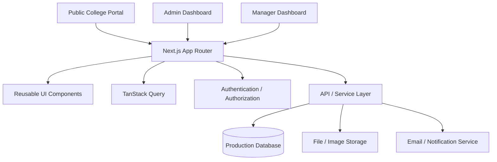
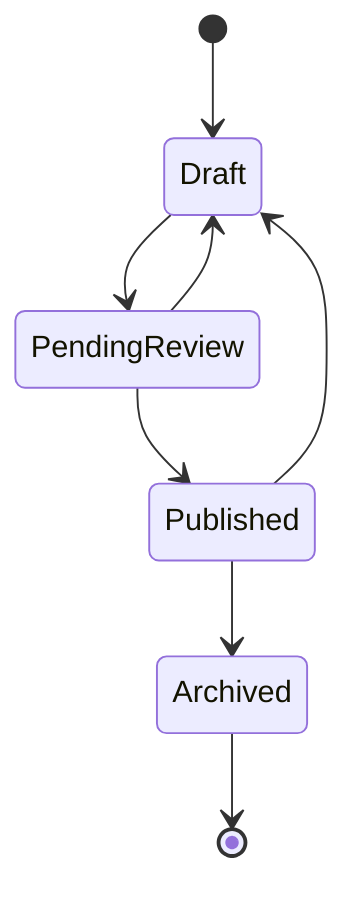

# College Digital Portal
## Phased Product Development & Submission Plan

### Project Overview

We are developing a modern digital platform for the college that will gradually evolve into a complete college information, community, and event management ecosystem.

The project will be delivered in **separate phases/submissions**. Each phase will be treated as an independent deliverable that adds a new capability to the existing platform.

This approach allows the college/client to review and approve each stage independently while keeping the overall product vision consistent.

---

# Phase 1 — College Public Portal
## Frontend & User Experience

### Objective

The first submission will focus **only on the frontend and public-facing experience** of the college portal.

At this stage, we will not build the administrative management system, club management accounts, or advanced event interaction features.

The goal is to establish the platform's:

- Visual identity
- Navigation structure
- Information architecture
- Public user experience
- Responsive design
- Overall product quality

This phase will serve as the **main public website foundation** for all future phases.

## What We Will Build

### 1. Home Page

The homepage will provide a clear overview of the college and its latest information.

It will include:

- College branding
- Main navigation
- Hero/introduction section
- Featured information
- Upcoming events preview
- Latest announcements
- Important notices
- Clubs/societies preview
- Important links
- Resources
- Footer
- Official contact information

The homepage will be designed to immediately communicate the purpose and identity of the platform.

### 2. Events Page

We will create a dedicated public events section.

It will allow visitors to explore:

- Upcoming events
- Past events
- Featured events
- Event categories
- Event dates
- Event organizers

Each event will have a dedicated detail view containing information such as:

- Event title
- Event image/banner
- Date
- Time
- Venue
- Organizer
- Description
- Registration information
- Related information

At this stage, event data will be represented using frontend/mock data.

### 3. Announcements Page

A dedicated announcements section will present important college updates.

It will include:

- Announcement title
- Date
- Category
- Short description
- Full announcement view
- Related information

The design will prioritize readability and quick discovery of recent updates.

### 4. Notices Page

The notices section will provide a formal area for official college notices.

It will include:

- Notice title
- Date
- Department
- Important status
- Description
- Document/PDF preview or download interface

### 5. About / College Information

We will create an official information section containing:

- About the college
- College overview
- Vision and mission
- Important information
- Departments/organizational information
- Contact information

The exact content structure will be finalized according to the college's requirements.

### 6. Clubs & Societies Showcase

In Phase 1, clubs will be presented as **public informational content only**.

Visitors will be able to see:

- Club name
- Club logo
- Description
- Category
- Department
- Basic information
- Related events

There will be **no club account or club management system in Phase 1**.

### 7. Resources / Important Links

A centralized resources section will provide access to important college links and information.

Examples:

- Academic resources
- Student resources
- Important forms
- Official websites
- Important portals
- Documents
- Contact information

### 8. Search & Navigation

The frontend will include a clean navigation and search experience so users can easily discover:

- Events
- Announcements
- Notices
- Clubs
- College information
- Resources

### 9. Responsive Design

The complete Phase 1 website will be designed for:

- Desktop
- Laptop
- Tablet
- Mobile

The focus will be on maintaining a consistent experience across different screen sizes.

### 10. UI States

The frontend will include appropriate:

- Loading states
- Empty states
- Error states
- Hover states
- Active states
- Responsive states

This will make the interface feel like a production product rather than a static prototype.

---

## Phase 1 Deliverable

At the end of Phase 1, the college/client will receive a **complete public-facing frontend portal**.

The submission will demonstrate:

**Home → Events → Announcements → Notices → About → Clubs → Resources → Search**

The purpose of this submission is to establish the **official digital identity and public experience** of the platform.

---

# Phase 2 — College Management & Community Portal
## Admin, Clubs & Accounts

### Objective

Phase 2 will be treated as a **new feature release built on top of the Phase 1 portal**.

While Phase 1 focuses on what the public can see, Phase 2 introduces the management infrastructure required to maintain the portal.

This phase will introduce **accounts, administration, club management, permissions, and real content management**.

---

## What We Will Build

### 1. Authentication & Accounts

We will introduce user accounts and authentication.

The system will support different account types based on the college's requirements.

The primary roles will be:

- Admin
- Manager
- User

### 2. Admin Portal

A dedicated administrative dashboard will be created.

The Admin will be able to manage the college platform from one centralized interface.

Admin capabilities will include:

- Dashboard
- Events management
- Announcements management
- Notices management
- Club management
- User management
- Manager management
- Content management
- Media/document management
- Permissions
- Basic activity monitoring

### 3. Club Accounts

Clubs will receive their own management capability.

Authorized club representatives can manage their club information, subject to the permissions defined by the college.

Club management can include:

- Club profile
- Club logo
- Description
- Contact information
- Social links
- Club events
- Announcements
- Club-related resources

This converts the Phase 1 static club showcase into a **managed club ecosystem**.

### 4. Manager Accounts

Managers will receive access to specific areas of the platform.

For example:

- Event Manager
- Club Manager
- Announcement Manager
- Notice Manager

Managers will only be able to access the modules assigned to them.

### 5. Role-Based Permissions

The platform will introduce proper permission management.

For example:

**Admin**
→ Full platform access

**Manager**
→ Access to assigned modules

**Club Account**
→ Access to its own club information and authorized features

**User**
→ Public/read-only access

The backend will enforce these permissions; they will not depend only on hiding buttons in the frontend.

### 6. Content Management

The content shown in Phase 1 will begin to come from the actual management system.

Authorized users will be able to manage:

- Events
- Announcements
- Notices
- Clubs
- Resources

### 7. Publishing Workflow

Official content can follow a controlled workflow:

**Draft → Review → Published → Archived**

This will allow the college to maintain control over official information.

### 8. Media & Documents

The portal will support management of:

- Event posters
- Club logos
- Notice PDFs
- Images
- Documents
- Other approved files

### 9. Basic Activity & Audit Information

Important administrative actions can be tracked.

For example:

- Who created an event
- Who edited a notice
- Who published an announcement
- When content was changed

---

## Phase 2 Deliverable

At the end of Phase 2, the platform will evolve from a **public information website into a real college management portal**.

The overall structure will become:

**Public Portal**
+
**Admin Portal**
+
**Manager Accounts**
+
**Club Accounts**
+
**Content Management**
+
**Role-Based Permissions**

This phase will establish the operational foundation of the platform.

---

# Phase 3 — Events Interaction & Community Engagement
## Events, Comments & People Interaction

### Objective

Phase 3 will be another independent feature release focused specifically on **interaction and engagement around college events**.

The purpose is to move beyond simply displaying events and allow people to actively participate in the event ecosystem.

---

## What We Will Build

### 1. Advanced Event Experience

Events will become more interactive.

Users will be able to access richer event information and interact with event content.

Potential capabilities include:

- Event discussions
- Event updates
- Related activities
- Event participation information
- Organizer information
- Event interaction

### 2. Comments System

Users will be able to participate in discussions around events.

The comment system can support:

- Adding comments
- Viewing comments
- Replies
- Comment timestamps
- User identity
- Comment moderation

The system will be designed to remain clean and easy to use.

### 3. People Talking / Discussion System

A dedicated interaction layer can allow students and participants to communicate around events.

Examples:

- Questions about an event
- Discussions
- Suggestions
- Event-related conversations
- Participant interactions

The goal is to make events feel like active community spaces rather than static information pages.

### 4. Event Participation

Depending on the final requirements, the event system can be expanded with:

- Registration
- Interested/going status
- Participant information
- Event reminders
- Registration links
- Participation tracking

### 5. Notifications

Users may receive notifications for relevant activities such as:

- Event updates
- Comment replies
- Important event announcements
- Registration-related updates

### 6. Moderation

Because users can interact with content, moderation controls will be introduced.

Authorized users can manage:

- Inappropriate comments
- Reported content
- Discussion moderation
- User restrictions where required

---

## Phase 3 Deliverable

At the end of Phase 3, the platform will become more than an information portal.

It will provide:

**Events**
+
**Participation**
+
**Comments**
+
**Discussions**
+
**Community Interaction**

This phase will establish the platform as a **college community and engagement system**.

---

# Product Evolution

The platform will grow progressively:

```text
PHASE 1
Public College Portal
        ↓
Information & Discovery
        ↓
────────────────────────
        ↓
PHASE 2
Management & Accounts
        ↓
Admin + Managers + Clubs
        ↓
Content Management
        ↓
────────────────────────
        ↓
PHASE 3
Interaction & Engagement
        ↓
Events + Comments + Discussions
        ↓
Community Participation
```

---

# Phase-wise Product Positioning

| Phase | Product Focus | Main Users | Primary Outcome |
|---|---|---|---|
| Phase 1 | Public Portal | Students, Faculty, Visitors | Discover college information |
| Phase 2 | Management Portal | Admins, Managers, Clubs | Manage college information |
| Phase 3 | Engagement Portal | Students, Participants, Organizers | Interact and participate |

---

# Why We Are Building It in Separate Phases

Each phase will be treated as an independent product milestone rather than trying to build the entire system at once.

### Phase 1

Establishes the **foundation and public experience**.

### Phase 2

Adds the **management and operational layer**.

### Phase 3

Adds the **interaction and community layer**.

This approach provides several advantages:

- The college can review progress after every submission.
- Each phase delivers a usable product.
- Feedback can be incorporated before the next phase.
- Development remains manageable.
- New requirements can be added without disrupting previous work.
- The product can grow based on actual college needs.

---

# Client Showcase Summary

## Phase 1 — Public College Portal

**We will build a modern, responsive college website that centralizes events, announcements, notices, clubs, college information, and important resources into one professional public-facing platform.**

## Phase 2 — College Management Portal

**We will extend the portal with authentication, admin and manager accounts, club accounts, role-based permissions, content management, publishing workflows, and other tools required to operate the platform.**

## Phase 3 — Events & Community Engagement

**We will extend the event experience with interaction features such as comments, discussions, participation, notifications, and moderation, allowing students and organizers to engage around college activities.**

---

# Final Vision

The long-term vision is to transform the platform from:

**A college information website**

into:

**A complete digital college ecosystem**

through a controlled progression:

**Discover → Manage → Engage**

Each phase will remain independently presentable and valuable while contributing to the same long-term product.

## 1. Recommended Technology

### Primary recommendation: Next.js + TypeScript

Use **Next.js with TypeScript** rather than plain React for this project.

Why:
- Excellent support for public, content-heavy pages
- Server-side rendering/static generation where useful
- Strong SEO for public college information
- File-based routing
- Image/font optimization
- Easy separation between public pages and admin/manager dashboards
- Production-ready architecture
- Can start frontend-first and add backend functionality later
- Good fit for a real-world showcase project

### Core stack

| Area | Technology | Purpose |
|---|---|---|
| Framework | Next.js (App Router) | Application framework |
| Language | TypeScript | Type safety and maintainability |
| Styling | Tailwind CSS | Lightweight, consistent UI |
| Components | shadcn/ui + Radix UI | Accessible reusable primitives |
| Server state | TanStack Query | API/server data, caching, mutations |
| Tables | TanStack Table | Admin/manager data tables |
| Forms | React Hook Form | Efficient forms |
| Validation | Zod | Shared schema validation |
| Icons | Lucide React | Consistent lightweight icons |
| Dates | date-fns | Date formatting/filtering |
| Client state | Zustand | Only for small UI/client state |
| URL state | nuqs | Search, filters, pagination in URL |
| Charts | Recharts | Admin analytics when required |
| Testing | Vitest + Testing Library | Unit/component tests |
| E2E | Playwright | Critical user-flow testing |
| Lint/format | ESLint + Prettier | Code quality |
| Package manager | pnpm | Fast, efficient dependency management |

### Important principle

Do **not** add libraries just because they are popular. Every dependency should solve a real problem.

---

## 2. High-Level Architecture



### Application areas

```text
/
├── Public Portal
│   ├── Home
│   ├── Events
│   ├── Announcements
│   ├── Notices
│   ├── Clubs
│   ├── Departments
│   ├── Resources
│   └── Search
│
├── Admin
│   ├── Dashboard
│   ├── Content
│   ├── Users
│   ├── Managers
│   ├── Roles & Permissions
│   ├── Media
│   └── Audit Logs
│
└── Manager
    ├── Dashboard
    ├── Events
    ├── Announcements
    ├── Notices
    ├── Clubs
    └── Assigned Content
```

---

## 3. Role & Permission Model

There are three primary roles.

### Admin

Full system control.

Can:
- Create, edit and delete content
- Upload documents/images
- Manage events
- Manage announcements/notices
- Create and manage clubs
- Create/invite managers
- Assign manager permissions
- Approve/publish content
- Manage users
- View audit logs
- Configure system-level settings

### Manager

Content/area management role.

Can:
- Manage assigned events
- Manage assigned announcements/notices
- Manage assigned clubs or departments
- Upload permitted media/documents
- Edit their assigned content
- Submit content for approval

Managers should **not automatically receive full admin permissions**.

### User

Read-only/public role.

Can:
- Browse events
- Read announcements
- Read notices
- Explore clubs
- Search/filter content
- View event details
- Access public resources

Cannot:
- Create
- Edit
- Delete
- Publish
- Manage users

### Recommended permission model

Do not hard-code every permission directly into UI components.

Use:

```text
Role
  ↓
Permissions
  ↓
Resource
  ↓
Action
```

Example:

```text
manager
  ├── events.read
  ├── events.create
  ├── events.update
  ├── announcements.read
  └── announcements.update
```

This allows the college to expand permissions later without rewriting the application.

---

## 4. Content Lifecycle

For official college content, introduce a publishing workflow.



Recommended statuses:
- Draft
- Pending Review
- Published
- Archived

For the first frontend milestone, the UI should already represent these states even if the backend is not implemented yet.

---